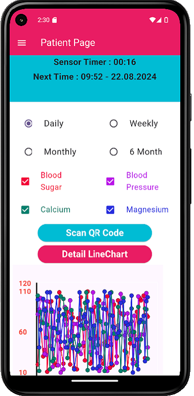

# <i>BloodCheck Mobil App </i>

    

## Youtube Link
* <a href="https://youtu.be/8S26pvvUJMc">Click here </a>to watch full video on YouTube.

## Content

<ol>
        <a href="#about-project"><li>About The Project</li></a>
        <a href="#why-project-created"><li>Why The Project Is Created?</li></a>
        <a href="#used-technologies"><li>Used Technologies</li></a>
        <a href="#image"><li>Images </li></a>
        </li>
        

<!--         <a href="#version-difference"><li>Version Difference</li></a> -->

</ol>

## 1-) About The Project

***BloodCheck Mobil App*** is a demo mobil medical app. There are 3 different user: admin, doctor and patient. Mainly, doctor can patients that assigned to him/her. Patient can see only his/her own blood results which are measured by mock sensor which creates random values. The most important side of the project is to get real time blood result values. If values are abnormal, then both user patient and patient's doctor got a notification as a emergency situation. <a href="https://play.google.com/store/apps/details?id=com.ahmeteminsaglik.bloodcheck">You can download the app from Play Store</a>

## 2-) Why The Project Is Created?

Project is created to for these purpose: 
- Using Real Time Notification (FCM - Firebase Cloud Messaging)
- Create a FullStack project
- Deploy Project (Backend and Mobil)

## 3-) Used Technologies

* Core Technologies:
    * Spring Boot
    * Flutter
    * React
    * MySQL
* Dependencies:
    * Spring Boot
        * Spring Boot Starter Parent: org.springframework.boot:spring-boot-starter-parent:3.3.1
        * Spring Boot Starter Web: org.springframework.boot
        * Spring Boot Starter logging: org.springframework.boot:spring-boot-starter-logging
        * Springdoc OpenAPI Starter: org.springdoc:springdoc-openapi-starter-webmvc-ui:2.2.0
        * Spring Boot Starter Data JPA: org.springframework.boot:spring-boot-starter-data-jpa
        * MySQL Connector: com.mysql:mysql-connector-j
        * Lombok: org.projectlombok:lombok
        * Firebase Admin SDK: com.google.firebase:firebase-admin:9.1.1
    * Flutter 
        * Local Notifications: flutter_local_notifications: ^13.0.0
        * Shared Preferences: shared_preferences: ^2.0.11
        * HTTP: http: ^1.1.0
        * FL Chart: fl_chart: ^0.63.0
        * Font Awesome Flutter: font_awesome_flutter: ^10.5.0
        * Flutter Bloc: flutter_bloc: ^8.1.3
        * QR Code Scanner: qr_code_scanner: ^1.0.1
        * Logger: logger: ^2.0.2
        * Firebase Core: firebase_core: ^2.24.2
        * Firebase Messaging: firebase_messaging: 
        * Firebase Analytics: firebase_analytics: 
        * Flutter Foreground Task: flutter_foreground_task: ^6.1.0
        * Flutter Background: flutter_background: ^1.2.0
        * Auto Orientation: auto_orientation: ^2.3.1

## 4-) Images 

 
 
 
 
 
 

   
